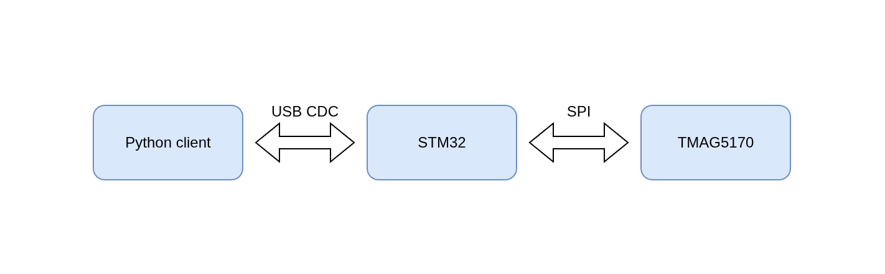
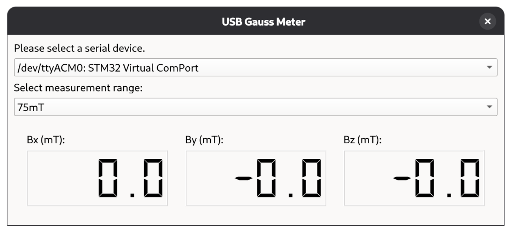

# USB 3D-Gauss Meter

This project is a USB 3D-Gauss Meter based on Texas Instrument's TMAG5170 Hall Sensor.
The Gauss Meter is powered by an STM32, which sends the measured data through USB.
A Python GUI client is provided to show the measured results.


## Python Client

The Python Client in this project depends on PySide6 and pyserial.
To install them, navigate to the python-client folder and install them with pip.
```
pip3 install -r requirements.txt
```
Then, run the python script to access the GUI.
```
python3 gauss-meter.py
```
In the GUI, select the STM32 Virtual ComPort to connect to the Gauss Meter.

