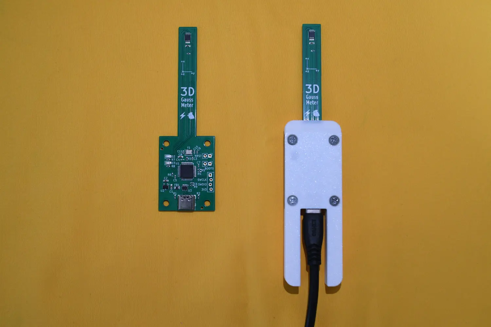

# USB 3D-Gauss Meter

This project is a USB 3D-Gauss Meter based on Texas Instrument's TMAG5170 Hall Sensor.
The Gauss Meter is powered by an STM32, which sends the measured data through USB.
A Python GUI client is provided to show the measured results.

## Files
- document: Images used in this README file.
- firmware: Source code of the firmware for the STM32.
- hardware: Kicad project of the PCB design.
- python-client: The Python GUI client. Please visit [my website](https://light655.github.io/Product/gauss_meter.html) for instructions.
- shell: The 3D-printed shell model.

## Python GUI client
Please visit [my website](https://light655.github.io/Product/gauss_meter.html) for instructions.
